# 《高级程序设计》大实验实验报告

161220096 欧阳鸿荣 （南京大学 计算机科学与技术系 南京 210093）

[TOC]

## 一.综述

### 1.总体介绍

该程序名为**StudentMS**(Student Management System)，为南京大学《高级程序设计》课程期末大实验。

| 系统名    | 语言和框架     | IDE        | 编译器      |
| --------- | -------------- | ---------- | ----------- |
| StudentMS | C++和Qt 5.11.2 | Qt Creator | MinGW 5.3.0 |

系统基于Qt 5.11.2的框架开发，是一个基于文档-视结构的学生信息程序，提供了可执行文件StudentMS.exe。

由于PDF不能显示GIF动图，因此可以点击 [Tsunaou的学生信息管理系统](https://tsunaou.github.io/StudentMS.html)查看更多详情

<div>
    
</div>

### 2.基本功能

- 新建、保存（导出）、导入学生信息文档
- 增加、修改、删除、排序学生信息

### 3.扩展功能

- 管理员登陆功能**(账号：Ouyang 密码：161220096)**
- 任意排序功能
- 多条件筛选功能
- 基于QSS的界面设计
- 数据的一致性和用户友好性

## <div STYLE="page-break-after: always;"></div>

## 二.系统介绍

### 1.系统结构

该程序由8个类所构建而成，其中StudentMS类是整个程序的主体。

| 类名            | 作用                                                         |
| --------------- | ------------------------------------------------------------ |
| StudentMS       | 程序窗口的主体，工具栏，菜单栏等的维护者，负责接收信号并传递给子窗口 |
| StuSubWindow    | 子窗口（文档界面），每个子窗口维护一个表格，存储信息         |
| StuInfoTemplate | 学生信息的模版，存储学号、姓名等学生信息，并提供对外接口     |
| StuDialog       | 学生信息输入和修改的对话框                                   |
| SortDialog      | 排序的对话框                                                 |
| LoginDialog     | 登陆的对话框                                                 |
| FilterDialog    | 信息筛选的对话框                                             |
| StyleSelector   | 样式选择器，提供修改样式的接口                               |

<div>
    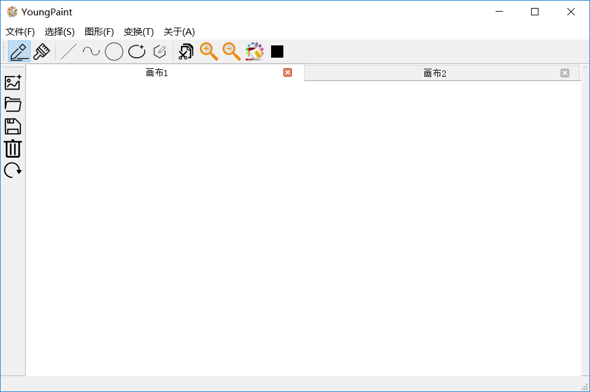
</div>


## <div STYLE="page-break-after: always;"></div>

### 2.类的设计

##### (1) StudentMS类

	```StudentMS```类是程序窗口的主体，工具栏，菜单栏等的维护者，负责接收信号并传递给子窗口。该类通过Qt提供的```mdiArea```维护一个多文档的子窗口结构。当用户对工具栏、菜单栏点击时，该类负责接受信息，并且将信息传递给当前active状态的子窗口（表格）。若子窗口不存在，会通过对话框提醒用户创建表格。

```c++
class StudentMS : public QMainWindow{
    Q_OBJECT
public:
    explicit StudentMS(QWidget *parent = nullptr);
    ~StudentMS();
    int getActiveTalbeIndex();  //得到当前活跃窗口的序号
    bool showLoginBox();        //展示登录框
    void timeUpdate();          //时间更新（实际上没用）
protected:
    void closeEvent(QCloseEvent *event);   //自定义关闭事件，提示保存
private slots:
    //文件
    void on_actionNew_triggered();      //新建窗口
    void on_actionClose_triggered();    //关闭当前窗口
    void on_actionSave_triggered();     //保存当前窗口内容
    void on_actionSaveAs_triggered();   //文件另存为
    void on_actionOpen_triggered();     //打开一条记录
    //编辑
    void on_actionAdd_triggered();      //增加一条记录
    void on_actionAlter_triggered();    //修改一条记录
    void on_actionDelete_triggered();   //删除一条记录
    void on_actionSortID_triggered();   //按照ID排序
    void on_actionSortName_triggered(); //按照姓名排序
    void on_actionSort_triggered();     //广义上的排序
    void on_actionFilter_triggered();   //筛选表格数据
    //查看
    void on_actionToolbar_toggled(bool arg1);   //查看工具栏
    void on_actionStatus_toggled(bool arg1);    //查看状态栏
    void on_actionOriginQss_triggered();    	//原始样式
    void on_actionQssBlue_triggered();      	//蓝色样式
    //窗口
    void on_actionTabBar_triggered();           //窗口标签模式
    void on_actionWindow_triggered();           //窗口窗口模式
    void on_actionTileSubWindows_triggered();   //窗口紧密堆叠
    void on_actionSascadeSubWindows_triggered();//窗口整齐排列
    //相关
    void on_actionAbout_triggered();    //相关信息
private:
    Ui::StudentMS *ui;
    QVector<StuSubWindow*> subWnds;     //维护子窗口
    QMap<QMdiSubWindow*,int> WindMap;   //存储当前活动的窗口
    QMap<QString,int> OpenMap;          //存储当前打开的文件(后期扩展可以防止打开同一个窗口)
    int tableIndex;                     //子窗口的数目
};
```

##### (2) StuSubWindow类

	```StuSubWindow```类是子窗口（文档界面），每个子窗口维护一个表格，存储信息  。负责接收从```StudentMS```类中传来的消息而处理各个事件。每个子窗口都是一个表格，同时通过存储文件路径映射到一个对应的文件上。这样便可以通过把同一个路径上的操作权都只赋予该路径对应的窗口，防止同时打开多个文件进行修改，而维护了数据的一致性。同时引入```flagModified```变量标记该文件是否被修改，如果被修改过，通过重定义的```closeEvent```消息事件，提醒用户在离开时保存文件，从而增加了文件的安全性。

```c++
class StuSubWindow : public QWidget
{
    Q_OBJECT
public:
    explicit StuSubWindow(QWidget *parent = nullptr);
    ~StuSubWindow();
    void addLine();     //增加一行数据
    void alterLine();   //修改一行数据
    void deleteLine();  //删除一行数据
    void sortByID();    //按照ID排序
    void sortByName();  //按照姓名排序
    void closeFile();   //关闭文件
    bool saveFile();    //保存
    bool saveFileAs();  //另存为
    bool saveTableTo(QString filepath);     //将文件保存到filepath上
    void importFile(QString fileName);      //导入文件内容
    void closeEvent(QCloseEvent *event);    //捕捉关闭事件
    void sortByUser();  //自定义排序
    void filter();      //自定义筛选
    //数据辅助处理函数
    StuInfoTemplate getTableForRow(int row);    //得到表格某一行的数据
    QString getFileNameWithoutFormat(QString filename); //得到某个路径下的文件名（不含格式）
    bool primaryKeyConfilct(QString ID,int before);//每个学生学号唯一(实际上是主)键不可重复
    QString getFilePath() const;            //得到文件路径
    bool QString_Matches//看是否存在匹配的字符串
    (const QString& str,const QString& pattern,const Qt::MatchFlags& flags);    
private slots:
    void on_tableWidget_cellDoubleClicked(int row, int column);    //双击事件
private:
    Ui::StuSubWindow *ui;
    QTableWidget* tb;           //当前窗口的表格
    FilterDialog *stuFilter;    //当前的筛选器
    SortDialog *stuSorter;      //当前的排序器
    QString filePath;           //文件路径
    bool flagModified;          //是否被修改过
};
```

## <div STYLE="page-break-after: always;"></div>

##### (3) StuInfoTemplate类

```StuInfoTemplate```类是学生信息的模版，存储学号、姓名等学生信息，并提供对外接口 。

```c++
class StuInfoTemplate{
public:
    StuInfoTemplate();
    StuInfoTemplate(QString ID,QString name,QString sex,QString birth,QString home,QString add);

    void showStuInfo();                     //打印信息
    void setID(const QString &value);       //设置学号
    void setName(const QString &value);     //设置姓名
    void setSex(const QString &value);      //设置性别
    void setBirthday(const QString &value); //设置出生日期
    void setHometown(const QString &value); //设置籍贯
    void setAddress(const QString &value);  //设置住址
    
    QString getID() const;      //得到学号             
    QString getName() const;    //得到姓名
    QString getSex() const;     //得到性别
    QString getBirthday() const;//得到出生日期
    QString getHometown() const;//得到籍贯   
    QString getAddress() const; //得到住址
private:
    QString ID;         //学号
    QString name;       //姓名
    QString sex;        //性别
    QString birthday;   //出生日期
    QString hometown;   //籍贯
    QString address;    //住址
};
```

##### (4) StyleSelector类

```StyleSelector```类样式选择器，提供修改样式的接口，提供了静态函数，可以给程序载入该路径的qss样式

```c++
class StyleSelector{
public:
    StyleSelector();
    //静态函数，载入该路径的qss样式
    static void setStyle(const QString &style) {
        QFile qss(style);
        qss.open(QFile::ReadOnly);
        qApp->setStyleSheet(qss.readAll());
        qss.close();
    }
};
```

##### (5) 其他类

StuDialog、SortDialog、LoginDialog、 FilterDialog 本质上都只是获取信息的对话框，因此不再赘述。

## 三.程序运行

#### 1.打开StudentMS.exe，展示欢迎界面，并要求管理员登陆

<div>
    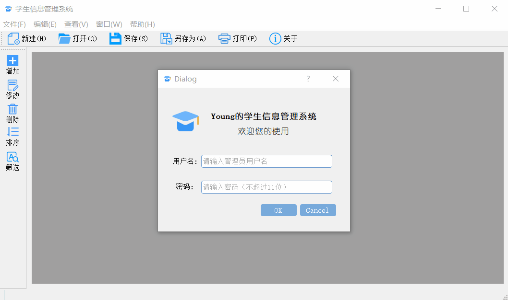
</div>


#### 2.登陆成功后，点击“新建”或快捷键“Ctrl+N”，即可新建表格

<div>
    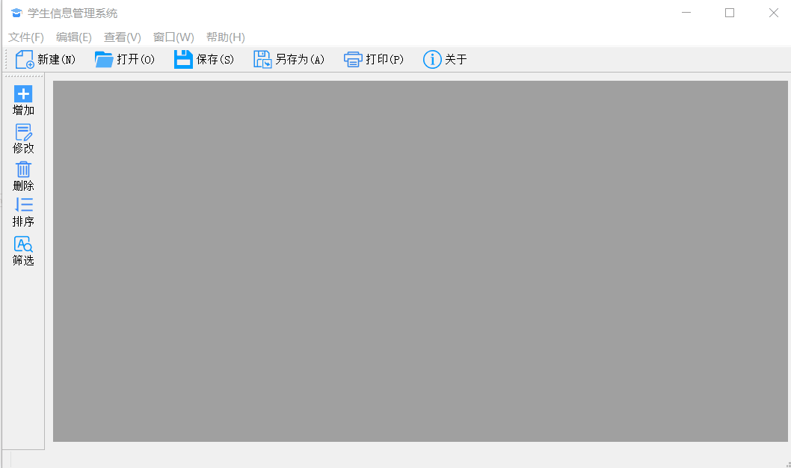
</div>


## <div STYLE="page-break-after: always;"></div>

#### 3.点击“增加”或者使用快捷键“Ctrl+A”即可增加一个表项

若修改或者增加时学号重复，则会阻止该项操作（将学号设为了主键，不可重复，也符合实际情况）

<div>
    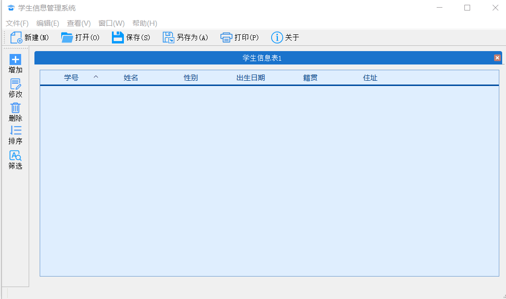
</div>

#### 4.点击“修改”或者使用双击表项即可修改一个表项

<div>
    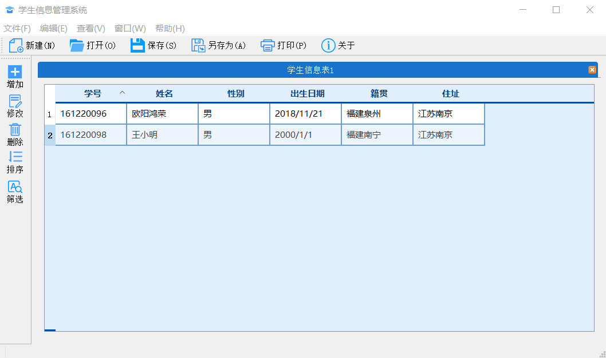
</div>


## <div STYLE="page-break-after: always;"></div>

#### 5.点击“删除”或者使用快捷键“Del”，即可修改一个表项

*（为了展示排序等功能，我们先打开一个测试样例）*

#### 6.点击“打开”则可打开一个文件

<div>
    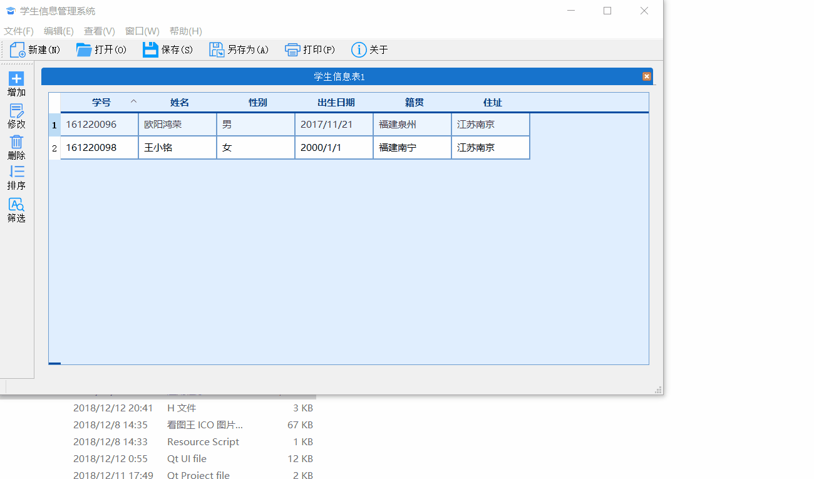
</div>


该文件的内容如下：（这里使用了文件标识符，旨在打开固定格式（由本系统创建）的文件，防止系统崩溃）

<div>
    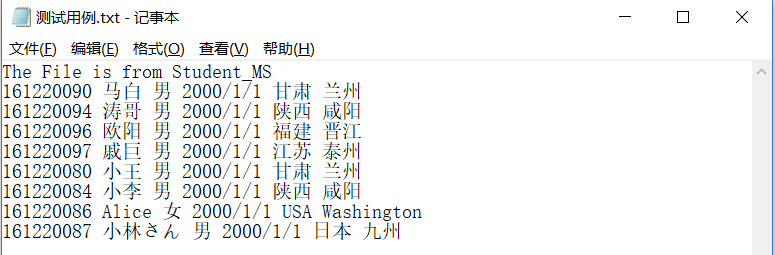
</div>

## <div STYLE="page-break-after: always;"></div>


#### 7.点击“编辑-排序-按姓名排序/按学号排序”则可对当前的窗口排序

##### (1) 系统要求的排序

- 按学号排序
- 按姓名排序


##### (2) 自定义排序

- 点击表头，点击即可对该项排序。并且可以通过重复点击制定升序降序

- 点击“排序”，通过对话框选择排序方式

  <div>
      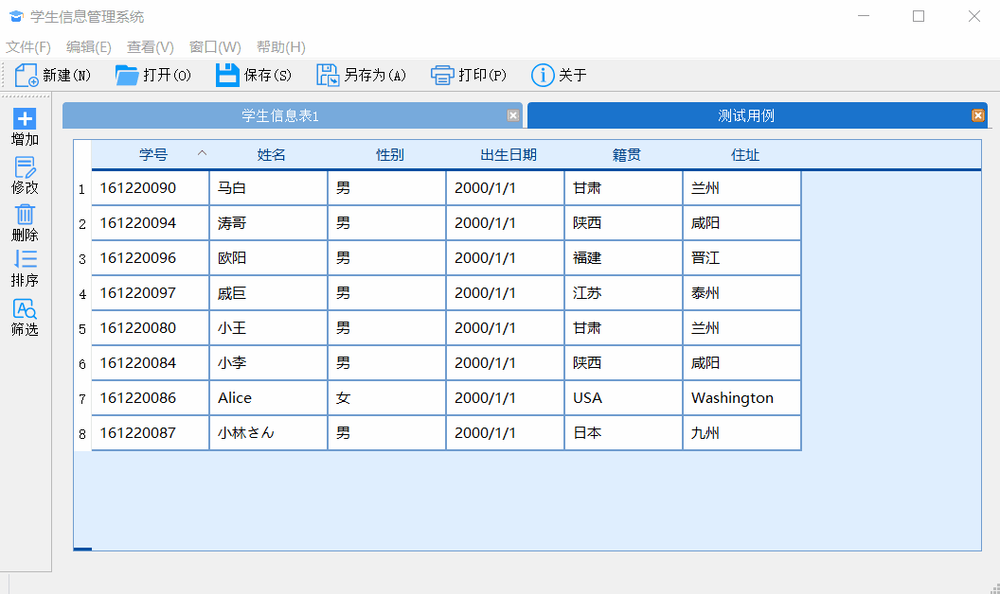
  </div>

#### 8.点击“筛选”则可对当前的表格的内容进行筛选


此处的筛选其实是一个查找/匹配的过程，查询目标可以选择全部或学号、姓名等，查找模式有部分匹配，前缀匹配，后缀匹配。而查找精度提供了正则表达式，大小写敏感，使用和通配符(?和*)三个选项，可以帮助用户在繁杂而冗余的数据中快速定位。其中正则表达式会覆盖前面的内容，为最高级精度。

<div>
    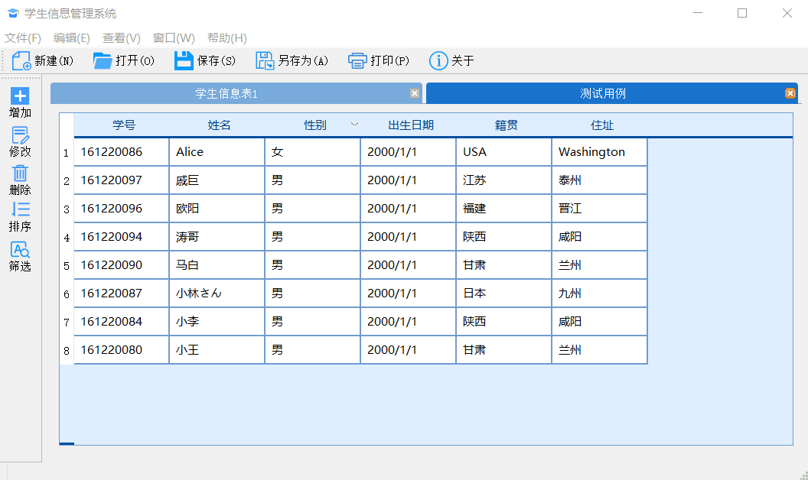
</div>

#### 9.点击“保存”或使用快捷键“Ctrl+S”则可保存当前的表格的内容

#### 10.点击“另存为”则可将当前的表格的内容另存为其他文件

当文件为新建时，保存执行的实际就是另存为的操作。当保存成功后，窗口名会改成保存后的文件名。之后，保存和另存为的行为便有了差异：保存是将修改后的内容保存在```StuSubWindow```类的文件路径里，而另存为是将文件按照其他名字保存在另外的目录下。

<div>
    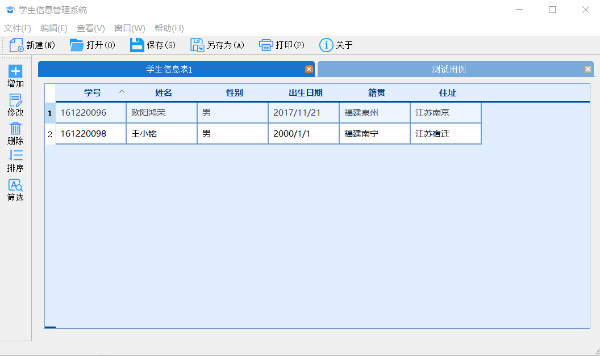
</div>

而引入文件保存和记录了文件路径后，便可以通过记录是否修改来对关闭和打开事件维护

- 若打开了已打开的文件路径对应的文件，则直接跳转到已打开的窗口
- 若修改文件（或者新建的文件）未保存而直接关闭，系统会发出提示和警告

<div>
    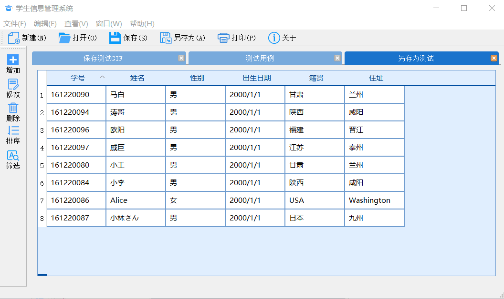
</div>

#### 11.一些界面显示上的额外功能

##### (1) 窗口的显示

这个功能其实是看样例程序里有就加上去的，虽然有点鸡肋。提供4种状态：

- 视窗标签模式：默认模式，上述的截图都是基于这这个模式

- 视窗窗口模式：

- 窗口重叠排列：

- 窗口整齐排列：


##### (2) 工具栏和状态栏的显示/隐藏


##### (3)主题的更换

程序默认显示的是我用qss美化过的界面，因此我提供了“换肤”操作，可以切换主题

<div>
    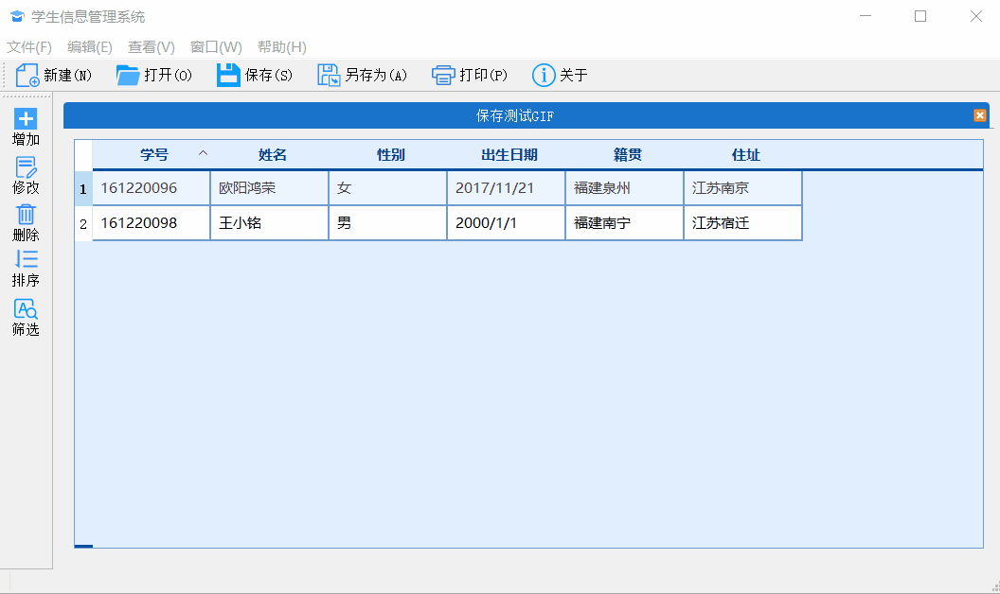
</div>


<div STYLE="page-break-after: always;"></div>

#### 12.关于

点击关于，会显示程序相关信息，可以通过该链接得到关于该程序的更多信息

<div>
    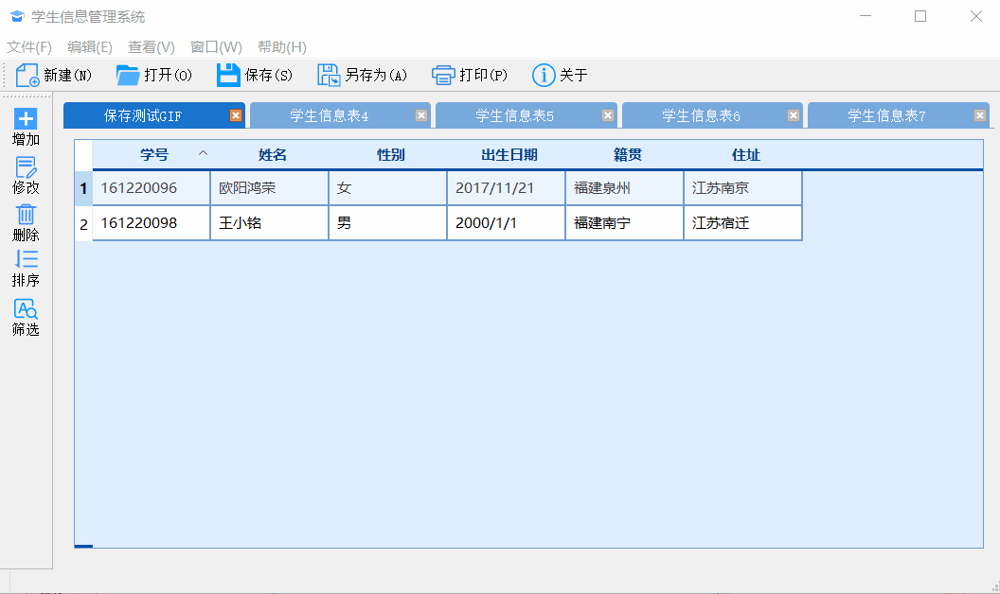
</div>


